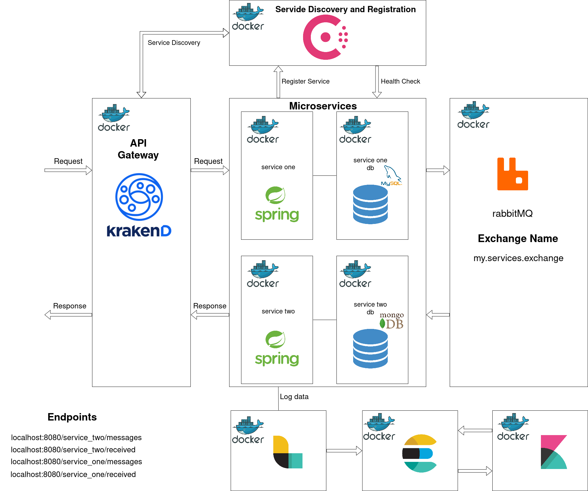
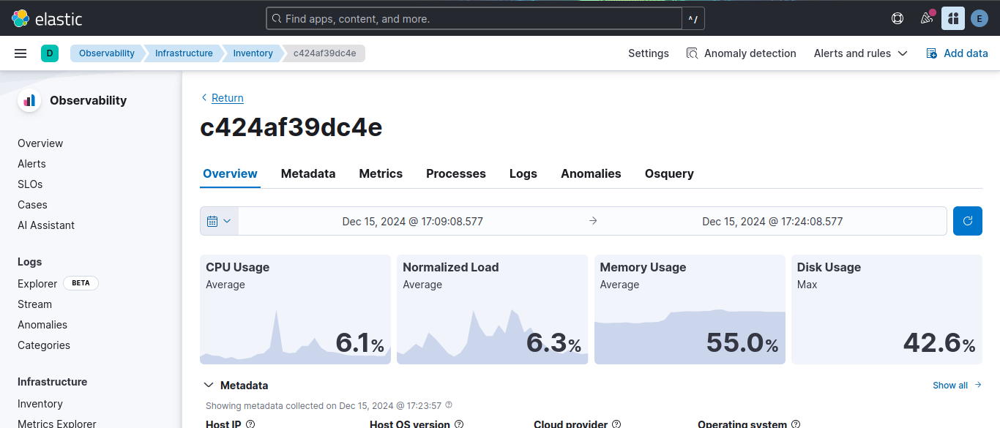
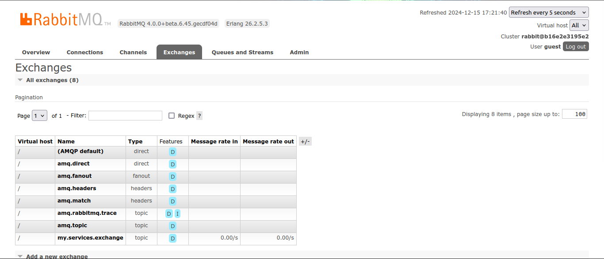

# Ejemplo Microservicios

Este es un proyecto ejemplo de una aplicación web que utiliza una arquitectura de microservicios.

## Arquitectura
Esta aplicación tiene dos servicios llamados service-one y service-two, cada uno de los cuales tiene su propia base de datos, donde almacenan los mensajes enviados y recibidos. Estos mensajes son generados de manera periódica y enviados de manera asíncrona a través del broker de mensajes (RabbitMQ).

Los servicios se registran en Consul el cual hace una verificación cada cierto tiempo para saber estado de los mismos (health check). 
Finalmente para consumir la información de los servicios lo hacemos a través del API gateway KrankenD el cual descubre dichos servicios a través de Consul. 

A continuación una imagen que muestra la artquitectura descripta.

## Caso de Uso
En la siguiente imagen vemos los mensajes enviados por el servicio uno.

Si comparamos con los mensajes recibidos por el servicio dos vemos que los valores son iguales.

Luego verificamos a la inversa los mensajes enviados por el servicio dos.

Vemos que tambien sus valores son iguales.

## Componente Integrados y Herramientas

### Registro y Descubrimiento de Servicios
En este ejemplo el registro y descubrimiento de servicios es llevado a cabo por HashiCorp’s Consul.
Durante el arranque de cada servicio, ellos se registran y le proveen la información como host, puerto 
y nombre, por las cuales el servicio puede ser accedido. Una vez que el servicio se registro, 
Consul verifica el estado del servicio enviando un heartbeat cada cierto periodo. 
Luego en este caso el api gateway contacta con Consul para obtener la información requerida 
para enviar el pedido al microservicio correcto.

La consola de manejo puede ser accedida a través de  http://localhost:8500/ui/dc1/services

### Monitoreo 
Los logs creados por las aplicaciones son enviados el servidor de logging 
(Logstash). Logstash formatea la información y la enviá al servidor de 
indexación (Elasticsearch). La información es almacenada en el servidor 
elasticsearch y es visualizada en Kibana.

Kibana: http://localhost:5601/app/kibana

También puede monitorearse los recursos del sistema con el servidor Metricbean.

### Comunicación Asíncrona 

En este ejemplo la intercomunicación entre microservicios se logra a través RabbitMQ. 

Para acceder a la consola de rabbitMQ usamos http://localhost:15672/

### Tecnologias
* [SpringBoot] - Framework
* [KrakenD] - API Gateway (Load Balancer)
* [Consul] - Registración y descubrimiento servicios
* [Docker] - Conteinerización
* [RabbitMQ] - Mensajes asíncronos entre microservicios
* [Logstash] - Recolector de Logs
* [Elasticsearch] - Indexación de Logs
* [Kibana] - Visualización de datos

   [Krakend]: <https://www.krakend.io/>
   [SpringBoot]: <https://projects.spring.io/spring-boot/>
   [Consul]: <https://www.consul.io>
   [Docker]: <https://www.docker.com>
   [Maven]: <https://maven.apache.org>
   [MySQL]: <https://www.mysql.com>
   [Git]: <https://git-scm.com>
   [Java]: <https://go.java>
   [Logstash]: <https://www.elastic.co/products/logstash>
   [Elasticsearch]: <https://www.elastic.co/products/elasticsearch>
   [Kibana]: <https://www.elastic.co/products/kibana>
   [RabbitMQ]: <https://www.rabbitmq.com/>
